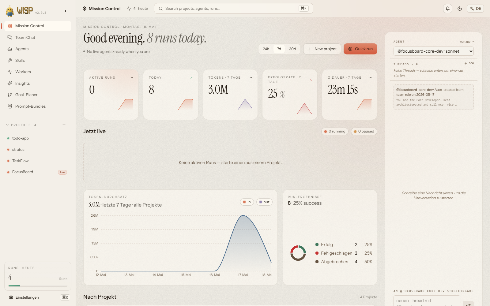
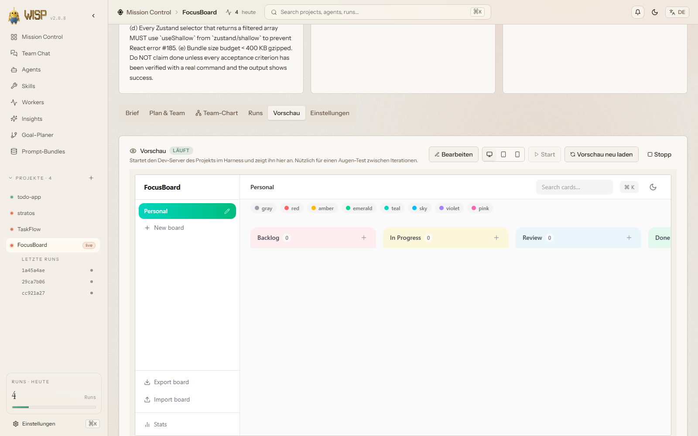
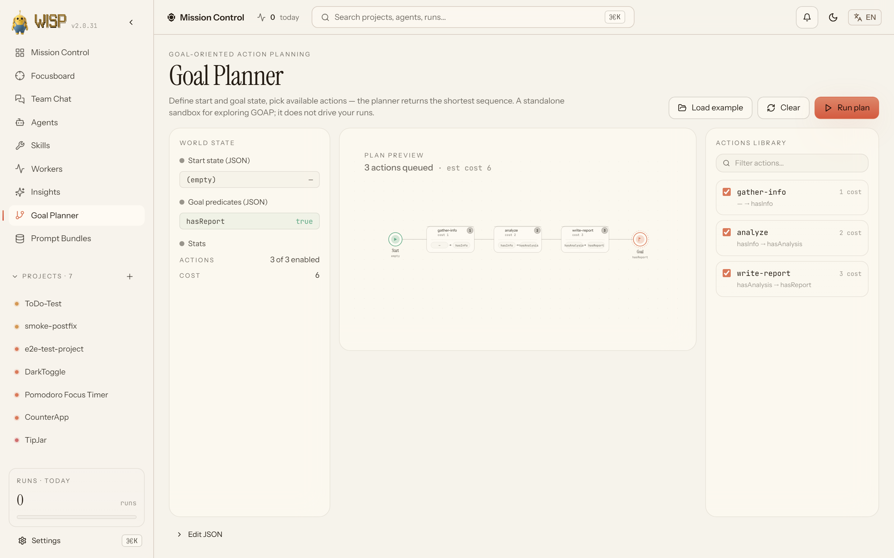
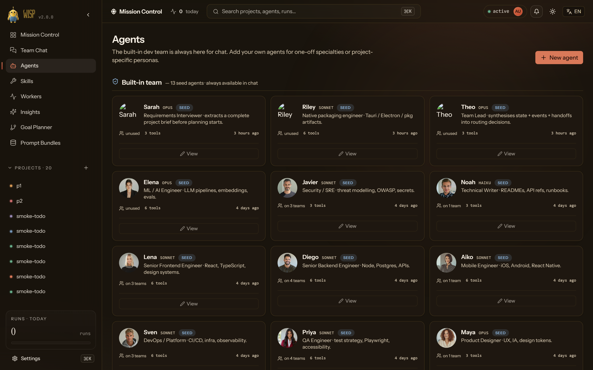
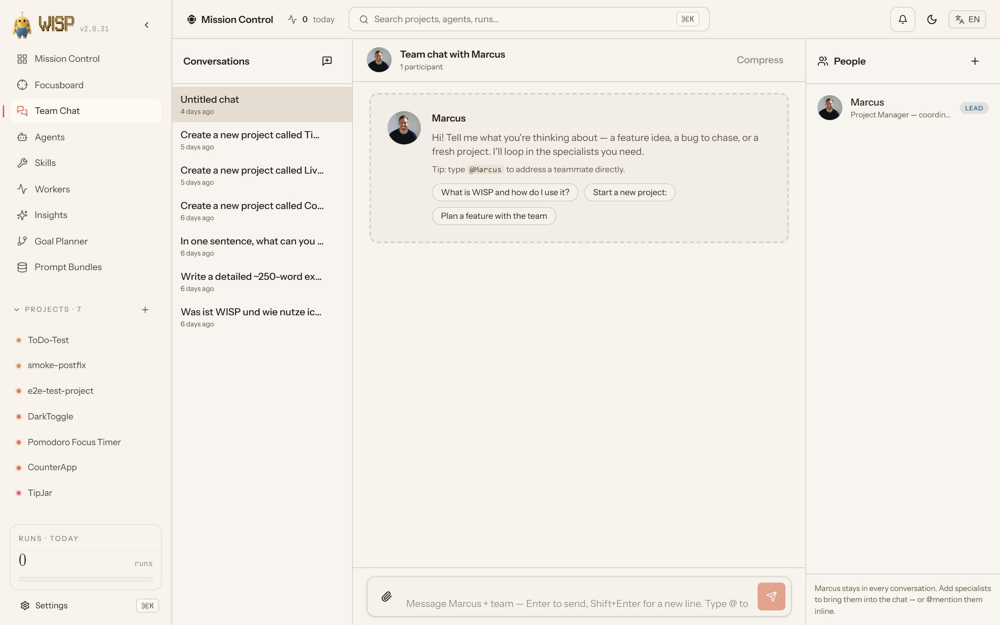
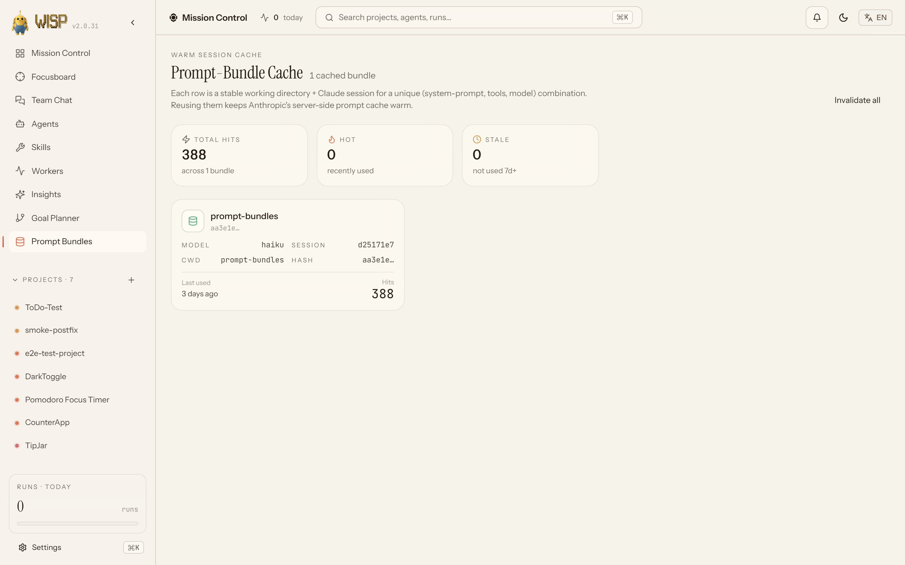
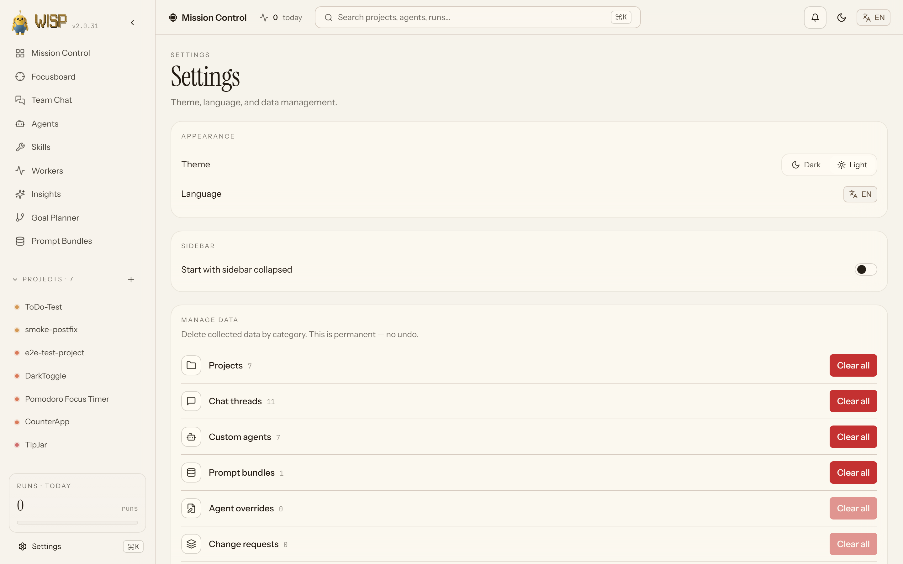

<p align="center">
  
</p>

<p align="center">
  
</p>

<p align="center"><b>Watch a team of Claude agents build, preview, and iterate on your app — live in your browser.</b></p>

<p align="center">
  <a href="https://github.com/Samuel0101010/wisp-orchestrator/releases"></a>
  <a href="LICENSE"></a>
  
  
  
  
  
  
</p>

<p align="center">
  
</p>

<p align="center"><sub><i>WISP's Mission Control — KPIs, live runs, agent thread, and project pulse at a glance. Drill into any project for the live execution graph and the Preview tab where the app actually runs.</i></sub></p>

## Why?

Most agent UIs run a single agent in a chat box. Orchestrators hide the plan behind opaque internal state, and they stop existing the moment something fails. WISP is built for the case nobody else covers — **drive a team of Claude agents for hours, watch the plan as a DAG you can edit before it runs, see the live preview of the app they're building, and write change-requests against the running result**.

- **No babysitting.** Runs survive rate-limit windows, server restarts, and Claude 5xx with transient retries + inactivity watchdog + auto-resume.
- **No black box.** Every plan is a DAG you can inspect, edit, and replan. Every task runs in its own git worktree. The walker streams every event into SQLite.
- **No cloud dependency.** Everything runs locally on your machine. Subscription auth via your `claude` CLI; flip to `WISP_AUTH_MODE=api` for headless commercial use.

## Quickstart (60 seconds)

> First time on this machine and `git` has no GitHub SSH key? Run the one-time HTTPS shim from [Install](#install) **before** command 1, or it fails with `Permission denied (publickey)` — even though the repo is public. Prerequisites: `git`, Node 22/24 LTS, and the `claude` CLI on `PATH`.

```sh
claude plugin marketplace add Samuel0101010/wisp-orchestrator
claude plugin install wisp@wisp-local
claude /wisp-dashboard          # opens http://127.0.0.1:4400 in your browser
```

Then click **New project**, type a goal ("Build a Kanban board in React + Vite + Tailwind"), point it at an empty git repo, and hit **Run**. The dashboard streams the agent team building the app, the **Preview** tab shows it running live, and the iteration loop is one click away.

## Dashboard tour

|                                    |                                   |
| :-------------------------------------------------------------------------------: | :----------------------------------------------------------------------------------------: |
| **Preview** — proxied iframe of the running app, with click-to-pick visual edits. | **Goal Planner** — a standalone Goal-Oriented Action Planning sandbox (least-cost search). |
|                                      |                                                   |
|                **Agents** — registry of roles available to teams.                 |                           **Chat** — team conversation surface.                            |
|                      |                                           |
|                  **Prompt Bundles** — cached bundles for re-use.                  |                  **Settings** — theme, language, selective data clearing.                  |

## Status

**v2.0 — production-ready.** The orchestrator drives full architect → dev → QA → review cycles against real Claude Max with variable team sizes, shared-memory MCP, built-in + user templates, automatic QA-replan, and a live dashboard with iteration loops, visual edit-mode, and proxied previews. See [CHANGELOG.md](CHANGELOG.md) for the full release history.

### Highlights in v2.0

- **Iteration loop.** Once an initial run completes, the user can request changes against the previewed app (click-to-pick element + change-request, or freeform prompt). The orchestrator generates an iteration plan that builds on prior runs and reuses the existing worktree, surfacing the diff back into the live preview without a manual rebuild step.
- **Reverse-proxy preview.** Vite/SvelteKit dev servers spawn under `/preview/<projectId>/` so the iframe sees the running app via the same origin as the dashboard. Auto-reload when an iteration run completes; manual refresh button in the preview header.
- **Goal Planner.** A standalone Goal-Oriented Action Planning _sandbox_: interactive plan visualization, JSON editor, filterable action library, and a least-cost search returning the cheapest action sequence to your goal predicates. A self-contained tool for exploring how a goal decomposes into steps — it does not create teams, edit plans, or drive runs (the LLM planner agent and Plan Editor do that).
- **Auto-resolver agent.** When a dependency-merge run hits conflicts in `pnpm-lock.yaml` or `package.json`, the orchestrator spawns a dedicated resolver agent to land a clean merge before continuing the parent run.
- **Hardened subprocess control.** Transient retries on Anthropic 5xx + Overloaded, worktree-race retries, inactivity watchdog that cancels stuck tasks with a structured event so the planner can re-route.
- **Notifications popover.** Top-bar bell lists the last 8 global runs across projects with status pills, relative-time labels anchored on `endedAt ?? startedAt`, and links into each run.
- **Plugin Skills.** Four `/wisp-*` slash commands so the dashboard is optional: `/wisp-new-run` (goal → running execution), `/wisp-resume` (paused runs), `/wisp-inspect` (result branch + git log), `/wisp-diagnose` (event timeline).

## Requirements

- Node.js >= 20.10 (**Node 22 LTS or 24 LTS recommended** — they ship a prebuilt `better-sqlite3`, so the first-launch build needs no C++ toolchain)
- pnpm >= 9 (bootstrapped for you on first launch via corepack/npm — no manual install needed)
- Claude Code CLI (the `claude` binary) on `PATH`
- Claude Max subscription (the orchestrator inherits `~/.claude/` credentials and unsets `ANTHROPIC_API_KEY` so subprocesses never silently fall back to API billing)
- Windows, macOS, or Linux

## Anthropic Terms of Service

WISP invokes only the official `claude` binary as a subprocess. It
never reads `~/.claude/credentials`, never extracts subscription OAuth tokens,
never calls `api.anthropic.com` endpoints directly, and actively unsets
`ANTHROPIC_API_KEY` before each spawn so subscription auth is the only path.

Subscriptions (Claude Pro / Max) are designed for personal use of the official
Claude products including Claude Code and its plugin/subagent system. Using
this plugin to run intensive headless workflows on a subscription account is
your responsibility under Anthropic's ToS. Balanced defaults
(`maxParallel=2`, `budgetMinutes=120`, `interTaskPacingMs=5000`,
`autoResumeRateLimit=false`) keep the traffic profile in line with intensive
human use rather than automated bulk usage. For commercial automation, set
`WISP_AUTH_MODE=api` and provide your own `ANTHROPIC_API_KEY` (paid per
token).

Two compliance test files (`tests/compliance/`) statically verify these
architectural commitments on every CI run. See
[docs/anthropic-compliance.md](./docs/anthropic-compliance.md) for the full
architectural rationale.

## Install

There are two supported paths.

### As a Claude Code plugin (preferred)

**Prerequisites on a fresh machine:** `git`, **Node 22 LTS or 24 LTS** (>= 20.10 works, but an LTS ships a prebuilt `better-sqlite3` so the first build needs no compiler), and the standalone `claude` CLI on `PATH`. pnpm is bootstrapped for you on first launch.

**One-time, only if `git` has no GitHub SSH key:** `claude plugin marketplace add` clones over SSH by default, which fails with `Permission denied (publickey)` even for this public repo. Tell git to use HTTPS for GitHub once, **before** the commands below:

```sh
git config --global "url.https://github.com/.insteadOf" "git@github.com:"
```

(In PowerShell keep the space between the two quoted arguments.)

```sh
claude plugin marketplace add Samuel0101010/wisp-orchestrator
claude plugin install wisp@wisp-local
claude /wisp-dashboard
```

(For local development, replace the first line with `claude plugin marketplace add /absolute/path/to/agent-harness`.)

The `/wisp-dashboard` command runs the launcher script for your platform (`scripts/launch-dashboard.ps1` on Windows, `scripts/launch-dashboard.sh` on POSIX). On the **first** invocation after a fresh install, the launcher auto-runs `pnpm install && pnpm build` (~1-2 minutes; pnpm is bootstrapped via corepack/npm if absent). On subsequent invocations it boots straight to the server. Either way it picks a free port in `4400-4500`, writes connection state to `${CLAUDE_PLUGIN_DATA}/state.json`, and opens the dashboard in your default browser.

**After the dashboard opens:** spawning agent runs needs the `claude` CLI authenticated (subscription, or `WISP_AUTH_MODE=api` with an `ANTHROPIC_API_KEY`). The dashboard boots and is browsable either way — but if auth is missing it shows a banner and `/api/health` carries the hint. Run `claude login` and restart `/wisp-dashboard` if you see it.

### From source (developer mode)

```sh
pnpm install
pnpm build
WISP_SERVE_WEB=1 node apps/dashboard-server/dist/server.js
# then open http://127.0.0.1:4400
```

With `WISP_SERVE_WEB=1` the dashboard server static-serves the built `apps/dashboard-web/dist/` from `/`, so a single port hosts UI + API + WS. To develop against a hot-reloading frontend instead, leave `WISP_SERVE_WEB` unset and run the Vite dev server in a second terminal:

```sh
pnpm --filter @wisp/dashboard-web dev
```

The Vite dev server runs at `http://localhost:5173` and proxies API/WS calls to the backend on `127.0.0.1:4400`.

## First run walkthrough

1. **Create a project.** Open the dashboard, click "New project" in the sidebar, and fill in name, goal, and `repoPath`. The repo path must point at an existing git-initialized directory; the orchestrator creates per-task worktrees inside it.
2. **Configure the team.** The TeamBuilder shows role cards (architect, developer, QA, …). Defaults are sensible: opus for architect + planner, sonnet for developer + QA. Edit `model`, `allowedTools`, or `systemPrompt` per role.
3. **Generate, review, run.** Hit "Generate plan" — the planner emits a DAG which renders in the PlanEditor (React Flow + dagre). Click any node to edit its prompt, dependencies, success criteria, or `maxTurns`. When the plan looks right, click "Lock & Run".
4. **Watch + iterate.** RunView opens with the kanban + streaming tail. When tasks land, switch to **Preview** to see the app running live. Click any element in the iframe to write a change-request; hit **Start iteration** when you want the team to apply them.

## Runtime verification (v1.8)

The harness now insists on **proving** an app runs before declaring it done, instead of trusting `build + test` green as a finish line.

- **Definition-of-Done card** on the project detail page lets you declare per-project acceptance criteria. Three kinds: `smoke` (HTTP probe of a URL), `e2e` (a Playwright-driven user action — the verifier writes the actual test from your one-line description), `manual` (human sign-off — never auto-passes; blocks auto-release until the approver clears it).
- **runtime-verifier agent** is auto-injected behind every terminal node of every new plan. It starts your dev server, drives Chromium against your DoD, writes `docs/runtime-report.{md,json}`, and stores screenshots / traces under `docs/runtime-evidence/`.
- **Release-gate** turns the verifier's verdict into one of READY / BLOCKED / MANUAL-REVIEW. BLOCKED runs are held back from auto-merge and feed their failing gates into the next self-healing iteration. Visible on the RunView as a verdict pill + Boot / E2E / DoD count badges.
- **Playwright auto-install.** First runtime-verify in a fresh install downloads Chromium once into `~/.cache/wisp/playwright-browsers`. Subsequent runs are instant — every worktree shares the cache via `PLAYWRIGHT_BROWSERS_PATH`.
- **`pnpm doctor`** — runs a quick check that Node, pnpm, `claude`, git, and the Playwright cache are all reachable. Diagnostic only; exits 0. Prints the exact one-liner to populate anything missing.

The whole layer is opt-in per project (`runtimeVerifyEnabled` defaults to ON; flip it off on the Production-Modus card to fall back to v1.7 behaviour). Plans created before v1.8 keep running with their old shape — the verifier only gets injected into newly-generated plans.

## Architecture

A single Fastify + WebSocket process owns SQLite, dispatches `claude -p` subprocesses through a `SubprocessPool`, and fans events out to a React dashboard. See [docs/architecture.md](docs/architecture.md) for the full breakdown.

```
+--------------------+        HTTP + WS         +-------------------+
|   dashboard-web    | <----------------------> |  dashboard-server |
|  (React + Vite)    |                          |     (Fastify)     |
+--------------------+                          +---------+---------+
                                                          |
                                          +---------------+---------------+
                                          |                               |
                                  +-------v-------+              +--------v-------+
                                  |   Drizzle +   |              |   RunRuntime   |
                                  |   SQLite      |              |   + Walker     |
                                  +---------------+              +--------+-------+
                                                                          |
                                                            +-------------+-------------+
                                                            | SubprocessPool            |
                                                            | (claude -p in worktrees)  |
                                                            +---------------------------+
```

## Configuration

The dashboard server reads its configuration from environment variables (parsed in [`apps/dashboard-server/src/env.ts`](apps/dashboard-server/src/env.ts)):

| Var                           | Default                                                                                      | Purpose                                                                                                                |
| ----------------------------- | -------------------------------------------------------------------------------------------- | ---------------------------------------------------------------------------------------------------------------------- |
| `WISP_PORT`                   | `4400`                                                                                       | TCP port for HTTP + WS server                                                                                          |
| `WISP_HOST`                   | `127.0.0.1`                                                                                  | Bind address                                                                                                           |
| `WISP_DATA_DIR`               | `~/.local/share/agent-harness` (Win: `%LOCALAPPDATA%\agent-harness`); required in production | Holds SQLite DB, snapshots, worktrees                                                                                  |
| `WISP_LOG_LEVEL`              | `info`                                                                                       | pino log level (`trace`, `debug`, `info`, `warn`, `error`, `fatal`, `silent`)                                          |
| `WISP_CORS_ORIGIN`            | `http://localhost:5173`                                                                      | Vite dev origin allowed by `@fastify/cors`                                                                             |
| `WISP_MOCK_CLI`               | `false`                                                                                      | Use mock fixtures instead of real `claude` (for tests)                                                                 |
| `WISP_SERVE_WEB`              | `false`                                                                                      | Static-serve `apps/dashboard-web/dist/` from `/` (single-port UI + API + WS)                                           |
| `WISP_INTER_TASK_PACING_MS`   | `5000`                                                                                       | Wallclock pause between consecutive task dispatches (subscription-friendly)                                            |
| `WISP_AUTO_RESUME_RATE_LIMIT` | `false`                                                                                      | When true, the walker auto-resumes a rate-limit pause at `resumeAt`. Off keeps the run paused for the user to inspect. |
| `WISP_AUTH_MODE`              | `subscription`                                                                               | `subscription` (default) or `api`. Toggles the auth-probe path; subprocesses always inherit `~/.claude/` credentials.  |

Notes:

- Setting `NODE_ENV=production` makes `WISP_DATA_DIR` mandatory and disables the pretty pino transport.
- `WISP_SERVE_WEB` requires that `apps/dashboard-web/dist/` exists. Run `pnpm build` first (or omit the flag and use the Vite dev server during development).

## Claude Code Hooks (optional)

The harness can capture telemetry from Claude Code sessions running inside this
repo via the bundled `.claude/settings.json`. To enable:

1. Pick a random shared secret and set it in `.env.local`:
   ```bash
   echo "WISP_HOOK_TOKEN=$(openssl rand -hex 16)" >> .env.local
   ```
2. Make sure the dashboard-server is running (`pnpm --filter dashboard-server dev`).
3. Open Claude Code in this repo. The hooks at `.claude/hooks/handler.cjs` will
   POST events to `http://127.0.0.1:4400/api/hooks/event` and you'll see them at
   `GET /api/hooks/events`.

Without `WISP_HOOK_TOKEN`, the handler exits silently and the server returns
503 — hooks are off by default and never block Claude Code.

## Development

Common scripts (run from the repo root):

```sh
pnpm dev             # all packages, parallel watch
pnpm build           # tsc -b across all packages
pnpm test            # unit tests only (e2e excluded — use test:e2e for those)
pnpm test:e2e        # Playwright smoke + a11y + i18n + tooltips + wave3
pnpm typecheck       # tsc -b --pretty
pnpm lint            # eslint .
pnpm format          # prettier --write
pnpm format:check    # prettier --check
pnpm encoding:check  # mojibake guardrail (UTF-8 double-encoding)
```

### Running the dashboard locally (Windows note)

The `pnpm dev` parallel wrapper does not stream backend logs cleanly on Windows
(`tsx watch` swallows stdout in some shell configurations). For interactive
work prefer the two-terminal split, and detach the backend process from the
parent shell when running long sessions so it survives a parent reap:

```pwsh
# Terminal A — backend (detached so it survives the parent PowerShell session)
Start-Process -NoNewWindow pnpm -ArgumentList 'exec','tsx','apps/dashboard-server/src/server.ts'

# Terminal B — frontend (HMR)
pnpm --filter dashboard-web exec vite
```

```sh
# POSIX equivalent
nohup pnpm exec tsx apps/dashboard-server/src/server.ts > harness.log 2>&1 &
pnpm --filter dashboard-web exec vite
```

The backend prints `server ready` on stdout (or in `harness.log`) when it's
listening on `:4400`; wait for that before opening `http://localhost:5173`. If
a long verification pass kills both processes with exit 127, it's almost
always the parent shell being reaped — re-run with `Start-Process`/`nohup` as
above rather than diagnosing further.

### Drizzle migrations

The dashboard-server owns the SQLite schema. To add a migration:

```sh
pnpm --filter @wisp/dashboard-server db:generate
pnpm --filter @wisp/dashboard-server db:migrate
```

Migrations run automatically on server boot via [`apps/dashboard-server/src/db/migrate.ts`](apps/dashboard-server/src/db/migrate.ts).

### Mock CLI mode

Setting `WISP_MOCK_CLI=1` swaps the real `claude` binary for a deterministic fixture, used by integration tests in [`packages/orchestrator/src/__tests__`](packages/orchestrator/src/__tests__) and [`apps/dashboard-server/src/__tests__`](apps/dashboard-server/src/__tests__). See [docs/development.md](docs/development.md) for how to write a new mock mode.

### End-to-end smoke test

A Playwright harness lives in [`tests/e2e/`](tests/e2e). One-time browser bundle download, then build + run:

```sh
pnpm exec playwright install chromium
pnpm build
pnpm test:e2e
```

The harness boots the dashboard with `WISP_SERVE_WEB=1` + `WISP_MOCK_CLI=1` on port 4499, drives the UI through the create-project → save-team → generate-plan → lock-and-run path, and asserts the run completes. See [tests/e2e/README.md](tests/e2e/README.md) for full details.

## Roadmap

v1.0 is **personal-use complete.** Open work past v1.0 is out of scope for this repo (the plan was always to ship the personal-use slice and stop).

Possible future directions, deliberately not pursued in v1.0:

- Anthropic-marketplace publication (kept private).
- Multi-tenant deployment (SQLite + per-machine paths assume one user).
- Direct-API mode beyond the existing `WISP_AUTH_MODE=api` stub.
- `(plan_id, task_id)` composite key in the `tasks` table so each replan version's per-task token totals are recorded independently. Today the events table is the audit source for replanned runs.

## License

Apache-2.0 — see [LICENSE](LICENSE).

## Repo layout

```
.
├── .claude-plugin/        # plugin.json + marketplace.json
├── agents/                # architect, developer, qa, planner agent specs
├── apps/
│   ├── dashboard-server/  # Fastify + Drizzle + WS, owns SQLite + Walker runtime
│   └── dashboard-web/     # Vite + React + Tailwind + shadcn dashboard
├── commands/              # /wisp-dashboard slash-command
├── docs/                  # architecture, agents, development reference
├── hooks/                 # PreCompact + SessionStart hook config
├── packages/
│   ├── orchestrator/      # subprocess + pool + walker + worktree + verification
│   ├── memory-mcp/        # M3 — stdio MCP server for shared per-run kv store
│   └── schemas/           # Drizzle DB schema + Zod plan/event/team schemas
├── skills/                # M6 — /wisp-new-run, -resume, -inspect, -diagnose
├── scripts/               # dashboard launcher (PowerShell + bash)
├── tests/
│   └── e2e/               # Playwright end-to-end harness
├── CHANGELOG.md
├── README.md
├── package.json
├── pnpm-workspace.yaml
└── tsconfig.base.json
```

## Further reading

- [docs/architecture.md](docs/architecture.md) — components, data flow, state machines, resilience matrix.
- [docs/agents.md](docs/agents.md) — role/model/tool contract for each agent.
- [docs/development.md](docs/development.md) — onboarding, gotchas, mock CLI, WS debugging.
- [CHANGELOG.md](CHANGELOG.md) — what shipped in M1.
